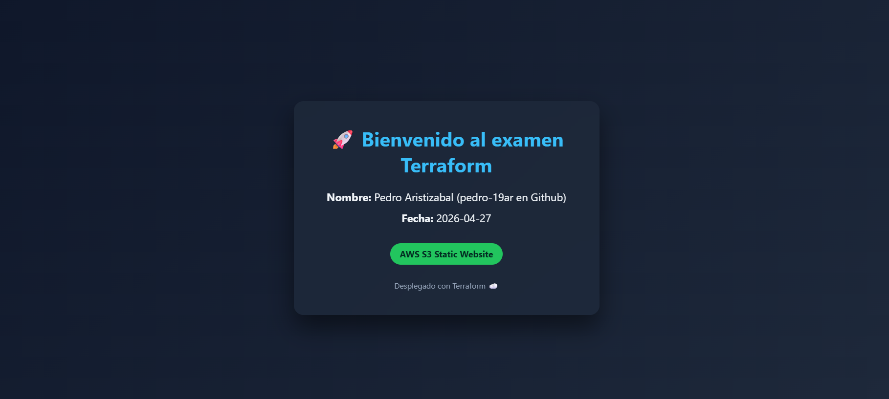

# 🚀 Terraform AWS S3 Static Website

Deployment of a static website on AWS using **Terraform**, following Infrastructure as Code (IaC) best practices.

---

## 📸 Project Preview



---

## 📌 Description

This project automates the deployment of a static website hosted on **Amazon S3**, using Terraform with a modular and scalable structure.

The solution includes:

* S3 bucket creation
* Static website hosting configuration
* Public access setup
* Automatic upload of `index.html`
* Use of variables and modules
* CI/CD implementation with GitHub Actions

---

## 🏗️ Project Structure

```bash
terraform-s3-web/
│
├── main.tf
├── variables.tf
├── outputs.tf
├── provider.tf
├── terraform.tfvars
│
├── modules/
│   └── s3_static_website/
│       ├── main.tf
│       ├── variables.tf
│       ├── outputs.tf
│
├── index.html
└── .github/
    └── workflows/
        └── deploy.yml
```

---

## ⚙️ Technologies Used

* Terraform >= 1.5
* AWS S3
* GitHub Actions (CI/CD)
* HTML + CSS

---

## 🚀 Deployment Steps

### 1. Initialize Terraform

```bash
terraform init
```

### 2. Validate configuration

```bash
terraform fmt
terraform validate
```

### 3. Review execution plan

```bash
terraform plan
```

### 4. Apply infrastructure

```bash
terraform apply
```

---

## 🌐 Output

After deployment, Terraform provides the public website URL:

```bash
terraform output website_url
```

---

## 🏷️ Tags

All resources include the following tags:

* `Environment = dev`
* `Owner = Pedro Aristizabal`
* `Project = Betek`

---

## 🔐 CI/CD with GitHub Actions

The project includes an automated pipeline:

```bash
.github/workflows/deploy.yml
```

Pipeline steps:

* terraform init
* terraform fmt
* terraform validate
* terraform plan
* terraform apply

Secure credentials are handled using GitHub Secrets:

* `AWS_ACCESS_KEY_ID`
* `AWS_SECRET_ACCESS_KEY`

---

## 📄 Web Page

The `index.html` file includes:

* Welcome message
* Student name
* Current date
* Modern responsive styling with CSS

---

## 👨‍💻 Author

**Pedro Aristizabal**
GitHub: pedro-19ar

---

## ✅ Project Status

✔ Infrastructure successfully deployed
✔ Public website accessible
✔ Modular Terraform code
✔ CI/CD pipeline implemented

---

## 📌 Notes

This project was developed as part of the **Final Exam - Terraform on AWS**, demonstrating skills in:

* Infrastructure as Code
* Cloud automation
* DevOps best practices

---
